Use JSON files to render images.
The intention is to create background images.
Randomization is part of the image creation.

# How to 

## install

```
cargo install --path .
```

## run

make sure `~/.cargo/bin` is in your `PATH`.
```
export PATH=""~/.cargo/bin/:$PATH"
```

create of find a JSON file (for example from 
[my repository](https://git.ingolf-wagner.de/palo/image-generator-lib)) and run

```
image-generator input.json --output background.png
```

now you can view it 
(`feh ./background.png`) or 
put set it as your background image 
(`feh --bg-scale ./background.png`).

## change stuff

You can change parameters like `--width` `--height` `--color`. For more information,
have a look at 

```
image-generator --help
```

# Documentation

Here is a rough overview on how to create the `input.json`.
For more detail you have to run `cargo doc` and
look into the `objects` and `structure` module.

Almost all parameters have a default value,
so you don't have to name them all.

For examples have a look at 
[my repository](https://git.ingolf-wagner.de/palo/image-generator-lib)).

## main structure

```json
{
  "width": 1366,
  "height": 768,
  "start": { "by_name" : "main" },
  "objects": {
    "main": { ... }
  }
}
```

The process on creating images is to create a drawing tree, 
made out of objects, 
and draw render this one.
All known object live in the `objects` field.
All objects also need to have a unique name.

The `start` field defines the query of the entry of the tree generation.
This parameter is the same one like the `query` parameter in the grid object.

## objects

These are all objects you can use in the `objects` field.
They are all your tools to create an image.

All objects are centered!


### line / icon

`line` and `icon` are very similar objects.
`line` objects will only draw the path,
but `icon` objects only fill the path.
To accomplish that `icon` objects always close the path.


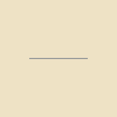

```json
{
  "type": "line",
  "color": "fill",
  "tags": ["tag1","tag2"],
  "path" : [
    {"x": -50, "y": 50},
    {"x": 50, "y": 50}
  ]
}
```

You can also create splines by using the `sa` and `sb` parameter.
`sa` is deforms the start of the line, and `sb` the end of the line.

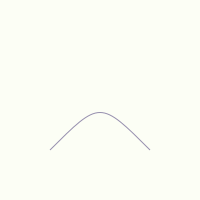

```json
{
  "type": "line",
  "color": "fill",
  "tags": ["tag1","tag2"],
  "path" : [
    {"x": -50, "y": 50},
    {"x": 50, "y": 50, "sa": {"x":0, "y":0}, "sb": {"x":0, "y":0}}
  ]
}
```

An icon is similar easy.

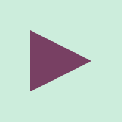

```json
{
  "type": "icon",
  "color": "fill",
  "tags": ["tag1","tag2"],
  "path" : [
    {"x": -50, "y": -50},
    {"x": -50, "y": 50},
    {"x": 50, "y": 0}
  ]
}
```

But you can see the path is automatically closed here.
The first and last point are not the same.

### ring / circle

Similar to icon and line, the circle is filling the circle and the 
ring will draw the outline of a circle.

The radius always defaults to 50.


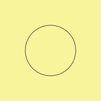

```json
{
  "type": "ring",
  "color": "fill",
  "tags": ["tag1","tag2"],
  "radius":50
}
```

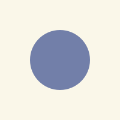

```json
{
  "type": "circle",
  "color": "fill",
  "tags": ["tag1","tag2"],
  "radius":50
}
```

### sequence

A `sequence` or short `seq` can be used to draw multiple objects on top of each other.
You can change 
* the center (using the `x` and `y` field)
* rotation (using the `angle` field)
* scale (using the `scale` field)

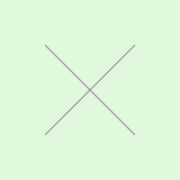

```json
{
  "type": "sequence",
  "objects" : [
    {"type":"line", "path": [{"x": -50, "y":-50}, {"x": 50, "y":50}]},
    {"type":"line", "path": [{"x": 50, "y":-50}, {"x": -50, "y":50}]}
  ]
}
```

### containers grid and sun

Containers help you to reuse other objects.
They handle placement of sub-objects and repetition.

You place the container using the `x` and `y` fields,
and you change the rotation using `angle` field.

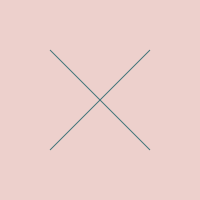

```json
{
  "width": 200,
  "height": 200,
  "start": { "by_name" : "main" },
  "objects": {
    "main" :{
      "type": "grid",
      "query": { "by_name":"x"}
    },
    "x": {
      "type": "sequence",
      "objects" : [
        {"type":"line", "path": [{"x": -50, "y":-50}, {"x": 50, "y":50}]},
        {"type":"line", "path": [{"x": 50, "y":-50}, {"x": -50, "y":50}]}
      ]
    }
  }
}
```

But it can repeat the objects in rows and columns.

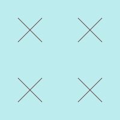

```json
{
  "width": 200,
  "height": 200,
  "start": { "by_name" : "main" },
  "objects": {
    "main" :{
      "type": "grid",
      "query": { "by_name":"x"},
      "scale":40,
      "rows":2,
      "columns":2
    },
    "x": {
      "type": "sequence",
      "objects" : [
        {"type":"line", "path": [{"x": -50, "y":-50}, {"x": 50, "y":50}]},
        {"type":"line", "path": [{"x": 50, "y":-50}, {"x": -50, "y":50}]}
      ]
    }
  }
}
```

The sun is similar to the `grid`, but arrange objects
on a ring.

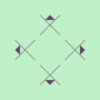

```json
{
  "width": 200,
  "height": 200,
  "start": { "by_name" : "main" },
  "objects": {
    "main" :{
      "type": "sun",
      "query": { "by_name":"x"},
      "scale":40,
      "radius": 50,
      "segments": 4
    },
    "x": {
      "type": "sequence",
      "objects" : [
        {"type":"line", "path": [{"x": -50, "y":-50}, {"x": 50, "y":50}]},
        {"type":"line", "path": [{"x": 50, "y":-50}, {"x": -50, "y":50}]},
        {"type":"icon", "path": [{"x": -25, "y":-25}, {"x": 25, "y":-25},{"y":-50}]}
      ]
    }
  }
}
```

### queries

containers have a `query` parameter, which finds the objects to be placed by the container.
If no object is found, it will just not draw nothing and continue with the next
position.

So far there are the following queries

#### `by_name`

You just give the name of the object. No randomization is involved in here.

#### `one_of_names`

Similar to `on_of_name` but multiple names are given.
As the name states one of the names will be choose to be drawn,
This is done randomly.


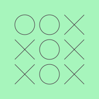
```json
{
  "width": 200,
  "height": 200,
  "start": { "by_name" : "main" },
  "objects": {
    "main" :{
      "type": "grid",
      "query": { "one_of_names":["x","o"]},
      "scale":40,
      "width":50,
      "height":50,
      "rows":3,
      "columns":3
    },
    "o": {"type": "ring"},
    "x": {
      "type": "sequence",
      "objects" : [
        {"type":"line", "path": [{"x": -50, "y":-50}, {"x": 50, "y":50}]},
        {"type":"line", "path": [{"x": 50, "y":-50}, {"x": -50, "y":50}]}
      ]
    }
  }
}
```

#### `by_tag`

Similar to `one_of_names` you give multiple tag names can be given.
One of the `tags` will be chosen, and than one of the objects which are tagged
with that tag will be chosen.

Only objects which have names, will be chosen from, so far deeper objects,
for example in `sequence` objects will not be considered. 


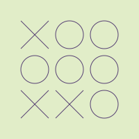
```json
{
  "width": 200,
  "height": 200,
  "start": { "by_name" : "main" },
  "objects": {
    "main" :{
      "type": "grid",
      "query": { "by_tag":["tictactoe"]},
      "scale":40,
      "width":50,
      "height":50,
      "rows":3,
      "columns":3
    },
    "o": {
      "type": "ring",
      "tags":["tictactoe"]
    },
    "x": {
      "type": "sequence",
      "tags":["tictactoe"],
      "objects" : [
        {"type":"line", "path": [{"x": -50, "y":-50}, {"x": 50, "y":50}]},
        {"type":"line", "path": [{"x": 50, "y":-50}, {"x": -50, "y":50}]}
      ]
    }
  }
}
```

### scaling

scaling of lines will not change the line size. the line size is constant and
can be configured in the main structure, as well as command line argument (`--line-size`).

## Links

If you have a repository where you store json to generate images, please let me know so I can link them here.

* [crate.io link]()
* [My Repository of Drawings](https://github.com/mrVanDalo/image-generator-examples)

